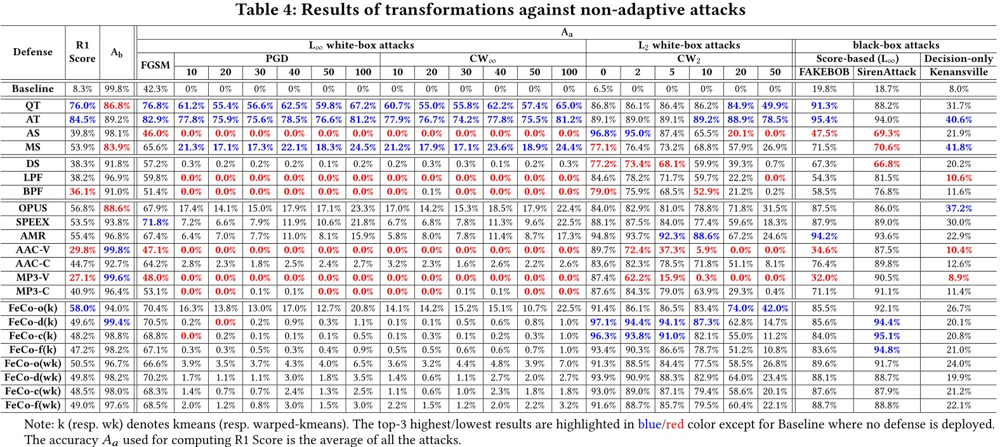
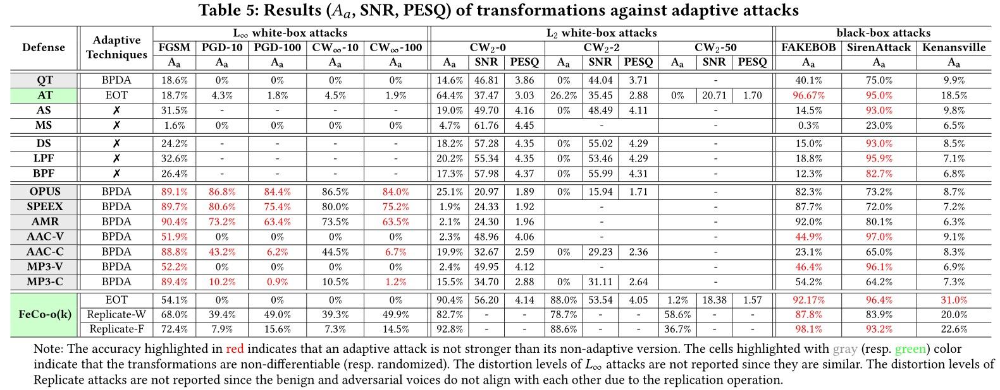
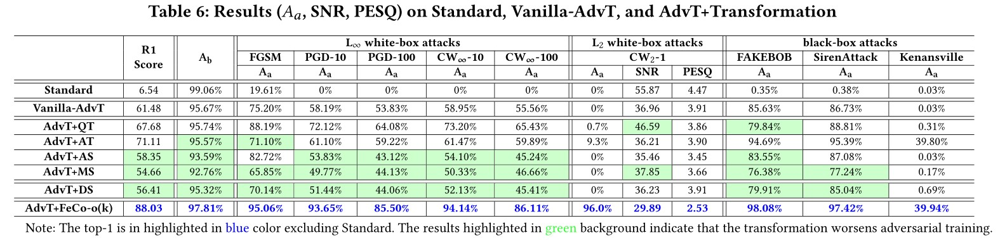

# About
This is the official webpage for paper ***Towards Understanding and Mitigating Audio Adversarial Examples for Speaker Recognition***. 

In this paper, we systematically investigate transformation and adversarial training based defenses for speaker recognition systems (SRSs) 
and thoroughly evaluate their effectiveness using both non-adaptive and adaptive attacks under the same settings. 

In summary, we make the following main contributions:
- We perform the most comprehensive investigation of transformation based defenses for securing SRSs
    according to the characteristic of audio signals and SRS's architecture
    and study the impact of their hyper-parameters
   for mitigating adversarial voices without incurring too much negative impact on the benign voices.

 - We thoroughly evaluate the proposed transformations
   for mitigating recent promising adversarial attacks
   on SRSs.  With regard for best practices in defense evaluations, we
   carefully analyze their strength, on both models trained naturally and adversarially, to withstand adaptive attacks.

  - Our study provides lots of useful insights and findings that could advance research on adversarial examples in this domain
    and assist the maintainers of SRSs to deploy suitable defense solutions to enhance their systems.
Particularly, we find that our novel feature-level transformations ***FeCo*** combined
with adversarial training is the most robust one against adaptive attacks.

  - We develop ***SpeakerGuard***, the first platform for systematic and comprehensive
    evaluation of adversarial attacks and defenses on speaker recognition.
    It features mainstream SRSs, proper datasets, white-box and black-box attacks, widely used evasion techniques for
    adaptive attacks, evaluation metrics, and diverse defense solutions.
    We release our platform to foster further research in this direction.

# Empirical Study Result
## Transformation against Non-adaptive Attacks

    
     
    

## Transformation against Adaptive Attacks

    
     
    

## Transformation+Adversarial-Training against Adaptive Attacks

    
     
    

# Audio Files
We provides our audio files for percetibility measurement and other purposes.

- [Original audios](https://drive.google.com/uc?id=1WctqJtP5Es74-U7y3cFXqfHi7JkDz6g5&export=download)

- [Adversarial audios produced by non-adaptive attacks](https://drive.google.com/uc?id=1CAOwwLsVYibEVdNXTwPVSIWP40Amuhr8&export=download)

- Adversarial audios produced by adaptive attacks against different defenses:

    - Time-domain defenses: [[QT]](https://drive.google.com/uc?id=1f9hAYRO1MIm-NNRdKmM44OAokPbMVs_z&export=download) [[AT]](https://drive.google.com/uc?id=1pDhJQFHk7puH7NFRzWBykLkwt-gQEFRr&export=download) [[AS]](https://drive.google.com/uc?id=1d7znPoTCkKQ-rzQrnrfZP1IxRZ7jOx4f&export=download) [[MS]](https://drive.google.com/uc?id=1TzuggGx3Xgb1czcGBv6Zq2KZzMygsvNd&export=download)

    - Frequency-domain defenses: [[DS]](https://drive.google.com/uc?id=1iVFUA2nej9xu7W0Y759TtssvEjy9R7G0&export=download) [[LPF]](https://drive.google.com/uc?id=1Xg-fYEMDxAM0VkOX7gL0mQnOFHwyi-AS&export=download) [[BPF]](https://drive.google.com/uc?id=1bFgy94zh3xKRLlo5zpo1PgLS6EZrxnBw&export=download)

    - Speech compression defenses: [[OPUS]](https://drive.google.com/uc?id=1qXvmigK5NfJdtV2GKSu-L9bm_29xlM5y&export=download) [[SPEEX]](https://drive.google.com/uc?id=13sqxpAtOOAdbAgj-tvexv3iEoV3kGbgW&export=download) [[AMR]](https://drive.google.com/uc?id=13nm9JoBlf-uj09tN9HaDOfhV0dG875r4&export=download) [[AAC-V]](https://drive.google.com/uc?id=1i2ZajGzABNuZNryy7RicSWWgRYnLVasr&export=download) [[AAC-C]](https://drive.google.com/uc?id=1UFXk2zNJ7SN5sn-83HCnFpozRlidMGWU&export=download) [[MP3-V]](https://drive.google.com/uc?id=1JyPp6Ya7ncSjeEHtnX8EZC7HJ5iVdR23&export=download) [[MP3-C]](https://drive.google.com/uc?id=1NiYKKMtwAL2JHoMLl83h1fjGloDbV_4G&export=download)

    - Feature-level defense: [[FeCo]](https://drive.google.com/uc?id=1bwz9WuDpv94tj77Zx_tJU_lwjQdwGZA7&export=download)
 
For adversarial audios, after unzip, the directory *A-B/X/X-Y/Z* means the audios are crafted by the attack X with the attack paramter Y against the defense A with the defense parameter B on the speaker Z. 
For example, *FeCo-ok-kmeans-raw-0_2-L2/FGSM/FGSM-0_002-50/1998* means the audios are crafted by FGSM attack with $\varepsilon=0.002$ and EOT_size $r=50$ against the defense FeCo with the defense parameter $cl_m=kmeans$ and $cl_r=0.2$ on the speaker 1998. 

# Platform: SpeakerGuard
To perform the above empirical study, we establish a security evaluation platform for speaker recognition. 

Want to re-produce our experimental results, do something new with our platform, or even extend SpeakerGuard? 
Go to [Code for SpeakerGuard](https://github.com/SpeakerGuard/SpeakerGuard) for detailed instructions.

